# Harness Pipeline Replication Tool

A Python tool to replicate Harness pipelines, input sets, templates, and triggers between
Harness accounts with an intuitive interactive interface or CLI option for automation.

---

## Quick Setup

### Automated Setup (Recommended)

For the fastest setup, use the included setup script:

```bash
# Make setup script executable and run it
chmod +x setup.sh
./setup.sh
```

**What the setup script does:**
- ✅ Checks Python 3.7+ is installed
- ✅ Installs all dependencies from `requirements.txt`
- ✅ Creates `config.json` from template if needed
- ✅ Provides next steps for configuration

### Manual Setup

If you prefer manual setup:

```bash
# Install dependencies
pip install -r requirements.txt

# Copy config template (optional)
cp config.example.json config.json
```

---

## Project Structure

The toolkit has been refactored into a modular structure for better maintainability:

```text
harness-replicate-pipeline/
├── src/                          # Core package (modular architecture)
│   ├── __init__.py              # Package exports
│   ├── api_client.py            # Harness API interactions
│   ├── config.py                # Configuration management
│   ├── replicator.py            # Main replication orchestrator
│   ├── ui.py                    # Interactive dialogs
│   ├── cli.py                   # Main CLI orchestrator
│   ├── argument_parser.py       # CLI argument parsing
│   ├── config_validator.py      # Configuration validation
│   ├── logging_utils.py         # Logging setup
│   ├── mode_handlers.py         # Interactive/non-interactive modes
│   ├── base_replicator.py       # Base class for handlers
│   ├── prerequisite_handler.py  # Org/project creation
│   ├── template_handler.py      # Template replication
│   ├── pipeline_handler.py      # Pipeline replication
│   ├── inputset_handler.py      # Input set replication
│   ├── trigger_handler.py       # Trigger replication
│   ├── yaml_utils.py            # YAML manipulation utilities
│   └── __main__.py              # Module entry point
├── main.py                      # Primary entry point
├── tests/                       # Comprehensive test suite
├── setup.sh                     # Automated setup
└── README.md                    # This file
```

**Usage Options:**
- **Main script**: `python main.py` (recommended)
- **Module**: `python -m src` (alternative)

---

## Testing

The project includes a comprehensive test suite with both unit tests and integration tests, organized in separate directories.

### Unit Tests (`tests/unit/`) - Recommended for Development

Unit tests run quickly and don't require external dependencies:

```bash
# Run all unit tests (default behavior)
pytest

# Run with coverage
pytest --cov=src --cov-report=term-missing

# Explicitly run unit tests
pytest tests/unit/ -v

# Run specific test file
pytest tests/unit/test_replicator.py -v
```

**Results**: ✅ 367 unit tests pass (100% success rate)

### Integration Tests (`tests/integration/`) - Requires Harness API Access

Integration tests make real API calls to Harness and require valid credentials:

```bash
# Quick setup and run
./run_integration_tests.sh

# Manual run (after configuring credentials)
pytest tests/integration/ -v -s

# Run specific integration test
pytest tests/integration/test_integration.py::TestIntegrationMigration::test_create_organization -v -s
```

**Setup Required**: See [`tests/integration/README.md`](tests/integration/README.md) for detailed setup instructions.

### Test Structure

```text
tests/
├── integration/                 # Integration tests (require Harness API)
│   ├── README.md               # Integration test documentation
│   ├── test_integration.py     # Core integration tests
│   └── test_trigger_integration.py  # Trigger-specific tests
├── test_*.py                   # Unit tests (no external dependencies)
└── README_INTEGRATION.md       # Legacy integration docs (deprecated)
```

### Running Tests in CI/CD

```yaml
# Harness Pipeline Example
pipeline:
  name: Test Migration Toolkit
  stages:
    - stage:
        name: Unit Tests
        type: CI
        spec:
          execution:
            steps:
              - step:
                  type: Run
                  name: Run Unit Tests
                  spec:
                    command: pytest tests/ --ignore=tests/integration --cov=src
    - stage:
        name: Integration Tests
        type: CI
        spec:
          execution:
            steps:
              - step:
                  type: Run
                  name: Run Integration Tests
                  spec:
                    command: pytest tests/integration/ -v
                    envVariables:
                      INTEGRATION_TEST_DEST_URL: <+secrets.getValue("harness_url")>
                      INTEGRATION_TEST_DEST_API_KEY: <+secrets.getValue("harness_api_key")>
```

---

## Quick Start

### Option 1: Automated Setup (Recommended)

```bash
# Run the setup script
chmod +x setup.sh
./setup.sh
```

Then skip to [Generate API Keys](#2-generate-api-keys) below.

### Option 2: Manual Setup

### 1. Install Dependencies

```bash
pip install -r requirements.txt
```

### 2. Generate API Keys

**For both source and destination accounts:**

1. Login to Harness (app.harness.io or app3.harness.io)
2. Click your profile → **+API Key** → **+Token**
3. Copy the token (starts with `pat.`)

### 3. Run the Tool

```bash
# Interactive mode (recommended for first time)
python main.py

# Always test first with dry-run
python main.py --dry-run
```

That's it! The interactive mode guides you through everything.

---

## Table of Contents

- [Features](#features)
- [Usage Modes](#usage-modes)
- [Navigation Guide](#navigation-guide)
- [Configuration](#configuration)
- [What Gets Migrated](#what-gets-replicated)
- [Commands](#commands)
- [Troubleshooting](#troubleshooting)
- [Best Practices](#best-practices)
- [FAQ](#faq)

---

## Features

**Interactive Mode:**
- Arrow key navigation (↑↓ to navigate, Space to select)
- Visual dialogs for selecting organizations, projects, and pipelines
- Multi-select pipelines with spacebar
- Pre-selection from previous runs
- No config files needed initially

**Replication:**
- Migrates complete pipeline YAML
- Automatically updates `orgIdentifier` and `projectIdentifier` in YAML
- Migrates input sets associated with pipelines
- Migrates triggers associated with pipelines (webhook, scheduled, etc.)
- Auto-replicates templates referenced by pipelines
- Cross-instance support (app.harness.io ↔ app3.harness.io)
- Auto-creates destination org/project if needed

**Safety & Control:**
- Dry-run mode (test without making changes)
- Skip existing pipelines option
- Debug mode with detailed logging
- Non-interactive mode for automation

**Code Quality & Reliability:**
- Recently refactored following industry best practices (DRY, KISS principles)
- 83% reduction in code complexity for improved stability
- Comprehensive error handling and validation
- Zero linter errors, fully type-safe
- Well-tested and production-ready

---

## Usage Modes

### Interactive Mode (Default)

Best for first-time use and manual migrations.

```bash
# Basic interactive mode
python main.py

# With dry-run (recommended first time)
python main.py --dry-run

# With debug logging
python main.py --debug
```

**Flow:**
1. Enter source credentials and select org/project/pipelines
2. Enter destination credentials and select/create org/project
3. Choose options (replicate input sets, skip existing)
4. Review and confirm

### Non-Interactive Mode

Best for automation and CI/CD.

```bash
# Uses config.json for all settings
python main.py --non-interactive

# With dry-run and debug
python main.py --non-interactive --dry-run --debug
```

**Requires:** Complete `config.json` with source, destination, and selected pipelines.

---

## Replication Process Flow

Here's how the tool works internally when you run a migration:

```mermaid
flowchart TD
    %% Color scheme for light/dark compatibility
    classDef start fill:#e8f5e8,stroke:#2e7d32,stroke-width:2px,color:#000
    classDef process fill:#e3f2fd,stroke:#1976d2,stroke-width:2px,color:#000
    classDef decision fill:#fff3e0,stroke:#f57c00,stroke-width:2px,color:#000
    classDef success fill:#e8f5e8,stroke:#388e3c,stroke-width:2px,color:#000
    classDef error fill:#ffebee,stroke:#d32f2f,stroke-width:2px,color:#000

    START([Start Migration]):::start
    
    %% Configuration Phase
    CONFIG{Mode?}:::decision
    INTERACTIVE[Interactive Mode<br/>• Show dialogs<br/>• Select resources<br/>• Confirm choices]:::process
    NONINTERACTIVE[Non-Interactive Mode<br/>• Load config.json<br/>• Validate settings<br/>• Use saved selections]:::process
    
    %% Validation Phase
    VALIDATE[Validate Configuration<br/>• Check API keys<br/>• Test connectivity<br/>• Verify permissions]:::process
    VALFAIL{Valid?}:::decision
    
    %% Prerequisites Phase
    PREREQ[Check Prerequisites<br/>• Source org/project exist?<br/>• Dest org/project exist?<br/>• Create if needed]:::process
    PREREQFAIL{Success?}:::decision
    
    %% Main Replication Phase
    PIPELINES[For Each Pipeline:]:::process
    TEMPLATES[Check Template Dependencies<br/>• Extract template refs from YAML<br/>• Auto-replicate missing templates]:::process
    CREATEPIPE[Create/Update Pipeline<br/>• Update org/project identifiers<br/>• Handle existing pipelines]:::process
    INPUTSETS[Replicate Input Sets<br/>• Find all input sets for pipeline<br/>• Create in destination]:::process
    TRIGGERS[Replicate Triggers<br/>• Find all triggers for pipeline<br/>• Create in destination<br/>• May reference input sets]:::process
    
    %% Completion
    SUMMARY[Generate Summary<br/>• Success/failed/skipped counts<br/>• Detailed report]:::process
    SUCCESS([Migration Complete]):::success
    FAIL([Migration Failed]):::error
    
    %% Flow connections
    START --> CONFIG
    CONFIG -->|Interactive| INTERACTIVE
    CONFIG -->|Non-Interactive| NONINTERACTIVE
    INTERACTIVE --> VALIDATE
    NONINTERACTIVE --> VALIDATE
    
    VALIDATE --> VALFAIL
    VALFAIL -->|No| FAIL
    VALFAIL -->|Yes| PREREQ
    
    PREREQ --> PREREQFAIL
    PREREQFAIL -->|No| FAIL
    PREREQFAIL -->|Yes| PIPELINES
    
    PIPELINES --> TEMPLATES
    TEMPLATES --> CREATEPIPE
    CREATEPIPE --> INPUTSETS
    INPUTSETS --> TRIGGERS
    TRIGGERS -->|More Pipelines?| PIPELINES
    TRIGGERS -->|Done| SUMMARY
    SUMMARY --> SUCCESS
```



**🔍 Key Decision Points:**
- **Dry Run**: All operations are simulated, no actual changes made
- **Skip Options**: `--skip-input-sets`, `--skip-triggers`, `--skip-templates`
- **Update Existing**: `--update-existing` vs skip existing resources
- **Template Dependencies**: Auto-replicated unless `--skip-templates` is used

---

## Navigation Guide

### Keyboard Controls

| Key | Action |
|-----|--------|
| **↑ / ↓** | Navigate through lists |
| **Space** | Select/deselect items (multi-select) |
| **Enter** | Confirm selection |
| **Tab** | Move between buttons |
| **Esc** | Cancel dialog |

### Dialog Examples

**Single Selection (Organizations/Projects):**
```text
┌─ SELECT ORGANIZATION ──────────┐
│   DevOps Team                  │
│ ● Production Org               │
│   Staging Org                  │
│                                │
│ [OK] [Cancel]                  │
└────────────────────────────────┘
```

**Multi-Selection (Pipelines):**
```text
┌─ SELECT PIPELINES ─────────────┐
│ [X] API Deploy Pipeline        │
│ [ ] Database Replication       │
│ [X] Frontend Build             │
│                                │
│ [OK] [Cancel]                  │
└────────────────────────────────┘
```

Use ↑↓ to navigate, Space to toggle [X], Enter to confirm.

---

## Configuration

### Full Config Example

```json
{
  "source": {
    "base_url": "https://app.harness.io",
    "api_key": "sat.xxxxx.xxxxx.xxxxx",
    "org": "source_org_id",
    "project": "source_project_id"
  },
  "destination": {
    "base_url": "https://app3.harness.io",
    "api_key": "sat.yyyyy.yyyyy.yyyyy",
    "org": "dest_org_id",
    "project": "dest_project_id"
  },
  "options": {
    "skip_input_sets": false,
    "skip_triggers": false,
    "skip_templates": false,
    "update_existing": false
  },
  "selected_pipelines": [
    {"identifier": "pipeline1", "name": "API Deploy"},
    {"identifier": "pipeline2", "name": "DB Replication"}
  ]
}
```

### Minimal Config (Interactive Mode)

You can start with just credentials:

```json
{
  "source": {
    "base_url": "https://app.harness.io",
    "api_key": "sat.xxxxx.xxxxx.xxxxx"
  },
  "destination": {
    "base_url": "https://app3.harness.io",
    "api_key": "sat.yyyyy.yyyyy.yyyyy"
  }
}
```

Interactive mode will prompt for org/project/pipeline selections.

### Options

| Option | Type | Default | Description |
|--------|------|---------|-------------|
| `skip_input_sets` | boolean | false | Skip replicating input sets with pipelines |
| `skip_triggers` | boolean | false | Skip replicating triggers with pipelines |
| `skip_templates` | boolean | false | Skip replicating missing templates automatically |
| `update_existing` | boolean | false | Update/overwrite existing pipelines instead of skipping |

**Configuration Examples:**

```json
{
  "options": {
    // Default behavior (replicate everything, skip existing)
    "skip_input_sets": false,
    "skip_triggers": false, 
    "skip_templates": false,
    "update_existing": false
  }
}
```

```json
{
  "options": {
    // Skip input sets and templates, update existing pipelines
    "skip_input_sets": true,
    "skip_triggers": false,
    "skip_templates": true, 
    "update_existing": true
  }
}
```

---

## Resource Dependencies & Replication Order

Understanding the dependency relationships between Harness resources is crucial for successful migration:


**🔄 Replication Order:**
1. **Prerequisites**: Organization & Project (auto-created if needed)
2. **Templates**: Auto-replicated when referenced by pipelines
3. **Pipelines**: Main resources being migrated
4. **Input Sets**: Replicated after their parent pipeline
5. **Triggers**: Replicated last (may reference input sets)

**💡 Key Points:**
- Templates are **dependencies** of pipelines - they must exist before pipeline creation
- Input Sets and Triggers are **children** of pipelines - they're replicated after the pipeline
- Triggers may reference Input Sets, so Input Sets are replicated first
- The tool handles all dependencies automatically in the correct order

---

## What Gets Migrated

### ✅ Migrated

**Pipelines:**
- Complete YAML configuration
- All stages, steps, and variables
- Auto-updated: `orgIdentifier` and `projectIdentifier`

**Input Sets:**
- All input sets for replicated pipelines
- Overlay input sets
- **Child Resource**: Replicated after parent pipeline creation
- Maintains relationship with parent pipelines
- Auto-updated: `orgIdentifier` and `projectIdentifier`

**Templates:**
- Pipeline templates referenced by pipelines
- Step group templates
- Stage templates
- **Dependency**: Must exist before pipeline creation
- Auto-replicated when pipeline dependencies are detected
- Auto-updated: `orgIdentifier` and `projectIdentifier`

**Triggers:**
- Webhook triggers
- Scheduled triggers
- All trigger types supported by Harness
- **Child Resource**: Replicated after parent pipeline and input sets
- May reference input sets, so replicated last in the dependency chain
- Auto-updated: `orgIdentifier` and `projectIdentifier`
- **Note:** Enabled by default, use `--skip-triggers` to disable

### ❌ NOT Migrated

The following are **not** replicated:

- Connectors
- Secrets
- Services, Environments, Infrastructure
- File Store files
- Execution history
- Standalone templates (not referenced by pipelines)

**Why?** This tool focuses on pipeline-related resources. Use Harness's built-in export/import or Terraform for other resources.

---

## Commands

### Command Line Options

**Basic Options:**
```bash
python main.py [OPTIONS]

Options:
  --config CONFIG          Path to config file (default: config.json)
  --non-interactive        Use config only, no prompts
  --dry-run               Test without making changes
  --debug                 Enable detailed logging
  -h, --help              Show help message
```

**Source Configuration:**
```bash
  --source-url URL         Source Harness base URL (e.g., https://app.harness.io)
  --source-api-key KEY     Source Harness API key (starts with 'sat.')
  --source-org ORG         Source organization identifier
  --source-project PROJ    Source project identifier
```

**Destination Configuration:**
```bash
  --dest-url URL           Destination Harness base URL (e.g., https://app3.harness.io)
  --dest-api-key KEY       Destination Harness API key (starts with 'sat.')
  --dest-org ORG           Destination organization identifier
  --dest-project PROJ      Destination project identifier
```

**Replication Options:**
```bash
  --skip-input-sets        Skip replicating input sets (default: replicate)
  --skip-triggers          Skip replicating triggers (default: replicate)
  --skip-templates         Skip replicating templates (default: replicate)
  --update-existing        Update existing pipelines (default: skip existing)
```

**Output Options:**
```bash
  --output-json            Output in JSON format for automation (default: terminal)
  --output-color           Enable colored terminal output (default: false)
```

### Configuration Priority

**Priority Order:** `Config file > Environment Variables > CLI arguments > Interactive prompts`

### Environment Variables

You can override any configuration option using environment variables:

**Connection Configuration:**
| Environment Variable | Config Option | Description |
|---------------------|---------------|-------------|
| `HARNESS_SOURCE_URL` | `source.base_url` | Source Harness URL |
| `HARNESS_SOURCE_API_KEY` | `source.api_key` | Source API key |
| `HARNESS_SOURCE_ORG` | `source.org` | Source organization |
| `HARNESS_SOURCE_PROJECT` | `source.project` | Source project |
| `HARNESS_DEST_URL` | `destination.base_url` | Destination Harness URL |
| `HARNESS_DEST_API_KEY` | `destination.api_key` | Destination API key |
| `HARNESS_DEST_ORG` | `destination.org` | Destination organization |
| `HARNESS_DEST_PROJECT` | `destination.project` | Destination project |

**Replication Options:**
| Environment Variable | Config Option | Description |
|---------------------|---------------|-------------|
| `HARNESS_SKIP_INPUT_SETS` | `options.skip_input_sets` | Skip replicating input sets |
| `HARNESS_SKIP_TRIGGERS` | `options.skip_triggers` | Skip replicating triggers |
| `HARNESS_SKIP_TEMPLATES` | `options.skip_templates` | Skip replicating templates |
| `HARNESS_UPDATE_EXISTING` | `options.update_existing` | Update existing pipelines |

**Output Options:**
| Environment Variable | Config Option | Description |
|---------------------|---------------|-------------|
| `HARNESS_OUTPUT_JSON` | `options.output_json` | Output in JSON format for automation |
| `HARNESS_OUTPUT_COLOR` | `options.output_color` | Enable colored terminal output |

**Runtime Flags:**
| Environment Variable | CLI Equivalent | Description |
|---------------------|---------------|-------------|
| `HARNESS_DRY_RUN` | `--dry-run` | Perform dry run without changes |
| `HARNESS_DEBUG` | `--debug` | Enable debug logging |
| `HARNESS_NON_INTERACTIVE` | `--non-interactive` | Skip interactive prompts |

**Environment Variable Values:** `true`, `1`, `yes`, `on` = true; anything else = false

**Examples:**
```bash
# Connection configuration via environment variables
export HARNESS_SOURCE_URL=https://app.harness.io
export HARNESS_SOURCE_API_KEY=sat.xxxxx.xxxxx.xxxxx
export HARNESS_DEST_URL=https://app3.harness.io
export HARNESS_DEST_API_KEY=sat.yyyyy.yyyyy.yyyyy

# Replication options via environment variables
export HARNESS_SKIP_INPUT_SETS=true
export HARNESS_UPDATE_EXISTING=true

# Output options via environment variables
export HARNESS_OUTPUT_JSON=true
export HARNESS_OUTPUT_COLOR=true

# Runtime flags via environment variables
export HARNESS_DRY_RUN=true
export HARNESS_DEBUG=true
export HARNESS_NON_INTERACTIVE=true

python main.py

# CLI arguments override both config file and environment variables
HARNESS_SKIP_TRIGGERS=true python main.py --skip-input-sets --non-interactive
```

**Priority Explanation:**
- **Config file values** are loaded first (step 1) - may not exist, uses as defaults
- **Environment variables** override config file values (step 2) - may not exist, overrides existing values
- **CLI arguments** override both config file and environment variables (step 3) - may not exist, overrides existing values
- **Interactive prompts** are the final override for any missing values (step 4) - overrides existing values
- **Final validation** checks for required variables and declares what must be set (step 5)

### Common Usage

**Interactive Mode:**
```bash
# Interactive with dry-run (recommended first)
python main.py --dry-run

# Interactive actual migration
python main.py

# Override specific values via CLI
python main.py --source-org my_org --dest-org target_org
```

**Non-Interactive Mode:**
```bash
# Use config file only
python main.py --non-interactive

# Override config with CLI args
python main.py --non-interactive --skip-input-sets

# Custom config file
python main.py --config prod.json --non-interactive
```

**Full CLI Configuration:**
```bash
# Minimal config file needed (just API keys)
python main.py \
  --source-url https://app.harness.io \
  --source-api-key sat.xxxxx.xxxxx.xxxxx \
  --source-org source_org \
  --source-project source_project \
  --dest-url https://app3.harness.io \
  --dest-api-key sat.yyyyy.yyyyy.yyyyy \
  --dest-org dest_org \
  --dest-project dest_project

# With migration options
python main.py \
  --source-url https://app.harness.io \
  --source-api-key sat.xxxxx.xxxxx.xxxxx \
  --dest-url https://app3.harness.io \
  --dest-api-key sat.yyyyy.yyyyy.yyyyy \
  --skip-input-sets \
  --update-existing
```

**Output Formatting:**
```bash
# JSON output for automation/scripting
python main.py --output-json --non-interactive

# Enable colors for terminal output
python main.py --output-color

# JSON output with environment variables
export HARNESS_OUTPUT_JSON=true
python main.py --non-interactive
```

**Debug and Testing:**
```bash
# Debug mode for troubleshooting
python main.py --debug

# Combined flags
python main.py --non-interactive --dry-run --debug

# JSON output with debug info
python main.py --output-json --debug --non-interactive
```

---

## Output Formats

The tool supports two output formats to accommodate different use cases:

### Terminal Output (Default)

**Features:**
- Colored output for better readability
- Real-time progress updates
- Formatted summary tables
- Enhanced error messages with context

**Example:**
```
12:30:45 [INFO] [replicator] Starting Harness Pipeline Replication
12:30:45 [INFO] [replicator] Source: source_org/source_project
12:30:45 [INFO] [replicator] Destination: dest_org/dest_project
12:30:46 [SUCCESS] [pipeline] Pipeline 'api_deploy' replicated successfully
12:30:47 [WARNING] [template] Template 'shared_template' not found, auto-replicating
12:30:48 [ERROR] [validation] Pipeline validation failed: missing required field

==================================================
REPLICATION SUMMARY
==================================================

PIPELINES:
  Success: 5
  Failed: 1
  Skipped: 2

TEMPLATES:
  Success: 3
  Failed: 0
  Skipped: 1
==================================================
```

### JSON Output (Automation)

**Features:**
- Structured data for programmatic processing
- Standardized error schemas
- Complete message history
- Machine-readable format

**Example:**
```json
{
  "timestamp": "2023-10-02T12:30:48.123456",
  "type": "summary",
  "data": {
    "pipelines": {"success": 5, "failed": 1, "skipped": 2},
    "templates": {"success": 3, "failed": 0, "skipped": 1}
  },
  "messages": [
    {
      "timestamp": "2023-10-02T12:30:45.123456",
      "level": "info",
      "category": "replicator",
      "message": "Starting Harness Pipeline Replication",
      "data": {}
    },
    {
      "timestamp": "2023-10-02T12:30:48.123456",
      "level": "error",
      "category": "validation",
      "message": "Pipeline validation failed: missing required field",
      "data": {"pipeline": "test_pipeline", "field": "identifier"}
    }
  ]
}
```

**Error Schema:**
```json
{
  "timestamp": "2023-10-02T12:30:48.123456",
  "type": "error",
  "error": {
    "type": "ValidationError",
    "message": "Pipeline validation failed",
    "context": {
      "pipeline": "test_pipeline",
      "field": "identifier",
      "expected": "string",
      "received": "null"
    }
  }
}
```

### Usage Guidelines

**Terminal Output (Interactive Use):**
- Default for human users
- Best for development and testing
- Provides immediate visual feedback
- Colors disabled by default (use --output-color to enable)
- Colors automatically disabled in non-TTY environments

**JSON Output (Automation):**
- Recommended for CI/CD pipelines
- Enables log parsing and monitoring
- Structured error handling
- Consistent data format across runs

---

## Configuration Decision Guide

Not sure which options to use? This decision tree helps you choose the right configuration:


**🎯 Quick Recommendations:**

| Scenario | Recommended Command |
|----------|-------------------|
| **First time user** | `python main.py --dry-run` |
| **Production migration** | `python main.py --save-config` then review |
| **CI/CD automation** | `python main.py --non-interactive --output-json` |
| **Update existing** | `python main.py --update-existing` |
| **Templates exist in dest** | `python main.py --skip-templates` |
| **Pipelines only** | `python main.py --skip-input-sets --skip-triggers` |
| **Troubleshooting** | `python main.py --debug --dry-run` |

---

## Troubleshooting

### Common Errors

#### 401 Unauthorized

```text
ERROR - API Error: 401 Client Error: Unauthorized
```

**Fix:**
- Verify API key is correct
- Check API key hasn't expired
- Regenerate API key if needed

#### 403 Forbidden

```text
ERROR - API Error: 403 Client Error: Forbidden
```

**Fix:**
- Check API key has Create permissions for destination
- Contact your Harness admin to grant permissions

#### 400 Bad Request (Pipeline Creation Failed)

```text
ERROR - API Error: 400 Client Error: Bad Request
```

**Fix:**
1. Run with `--debug` flag
2. Check log file: `migration_*.log`
3. Verify source pipeline YAML is valid
4. Ensure connectors/secrets exist in destination

#### 404 Not Found (Org/Project)

```text
ERROR - Destination organization 'my_org' does not exist
```

**Fix:**
- Script will auto-create if you have permissions
- If auto-creation fails, create manually first

### Debug Mode

Enable detailed logging:

```bash
python main.py --debug
```

Shows:
- Full API request URLs
- Request/response details
- Pipeline YAML structure
- Detailed error messages

### Log Files

Every migration creates: `migration_YYYYMMDD_HHMMSS.log`

```bash
# View latest log
tail -f migration_*.log

# Search for errors
grep ERROR migration_*.log
```

---

## Best Practices

### Before Replication

1. **Always dry-run first**
   ```bash
   python main.py --dry-run
   ```

2. **Start small**
   - Migrate 1-2 test pipelines first
   - Verify they work
   - Then replicate the rest

3. **Check dependencies**
   - Verify connectors exist in destination
   - Ensure secrets are available
   - Check service/environment definitions

4. **Required permissions**
   - Source: View pipelines and input sets
   - Destination: Create orgs, projects, pipelines, input sets

### During Replication

1. **Monitor logs in real-time**
   ```bash
   tail -f migration_*.log
   ```

2. **Don't interrupt**
   - Let migration complete
   - If interrupted, re-run with `skip_existing: true`

### After Replication

1. **Validate pipelines**
   - Open each pipeline in Harness UI
   - Verify YAML is correct
   - Check stages and steps

2. **Test execution**
   - Run each pipeline manually
   - Verify input sets work
   - Check outputs

3. **Update references**
   - Update triggers
   - Update webhooks
   - Update documentation

4. **Clean up**
   - Rotate/delete API keys
   - Archive migration logs

---

## FAQ

### Can I replicate between different organizations?

Yes! Specify different org/project for source and destination.

### Can I replicate between app.harness.io and app3.harness.io?

Yes! The tool supports cross-instance migration.

### What happens to connector/secret references in pipelines?

The YAML references remain unchanged. Ensure those connectors/secrets exist in destination with the same identifiers.

### Can I replicate just one pipeline?

Yes! Select only the pipeline(s) you want in interactive mode, or specify in config:
```json
{
  "selected_pipelines": [
    {"identifier": "my_pipeline", "name": "My Pipeline"}
  ]
}
```

### Will it create destination org/project?

Yes, automatically if you have permissions.

### Can I resume a failed migration?

Yes! Set `skip_existing: true` and re-run. Already-replicated pipelines will be skipped.

### How do I know if migration succeeded?

Check the summary:
```text
PIPELINES:
  Success: 5
  Failed: 0
  Skipped: 3

INPUT_SETS:
  Success: 12
  Failed: 0
  Skipped: 0

TEMPLATES:
  Success: 8
  Failed: 0
  Skipped: 2
```

Also review `migration_*.log` for details.

### What API version does this use?

Harness v1 API: `/v1/orgs/{org}/projects/{project}/pipelines`

---

## Advanced Usage

### Selective Replication

Migrate specific pipelines only:

```json
{
  "selected_pipelines": [
    {"identifier": "prod_deploy", "name": "Production Deploy"},
    {"identifier": "staging_deploy", "name": "Staging Deploy"}
  ]
}
```

### CI/CD Integration

```yaml
# Harness Pipeline for Migration
pipeline:
  name: Pipeline Migration
  stages:
    - stage:
        name: Migrate Pipelines
        type: CI
        spec:
          execution:
            steps:
              - step:
                  type: Run
                  name: Run Migration
                  spec:
                    command: |
                      python main.py --non-interactive --output-json \
                        --source-url <+secrets.getValue("source_url")> \
                        --source-api-key <+secrets.getValue("source_api_key")> \
                        --dest-url <+secrets.getValue("dest_url")> \
                        --dest-api-key <+secrets.getValue("dest_api_key")>
```

### Skip vs Update Existing

**Skip (Recommended):**
```json
{"options": {"skip_existing": true}}
```

**Update (Overwrites):**
```json
{"options": {"skip_existing": false}}
```

---

## Security

**API Keys:**
- Never commit `config.json` with API keys to version control
- Use environment variables in CI/CD
- Rotate keys after migration
- Use minimum required permissions

**Log Files:**
- May contain sensitive data
- Review before sharing
- Delete after migration
- Add `*.log` to `.gitignore`

**Access Control:**
- Use read-only keys for source
- Limit destination keys to specific org/project if possible

---

## Requirements

- Python 3.7+
- `requests>=2.31.0`
- `prompt_toolkit>=3.0.0`

**Supported Platforms:**
- Linux (preferred)
- macOS
- Windows (with compatible terminal)

**Harness:**
- API v1
- NextGen only
- app.harness.io or app3.harness.io

---

## Quick Reference

### Essential Commands
```bash
# Setup (first time only)
chmod +x setup.sh && ./setup.sh

# Dry-run (always start here)
python main.py --dry-run

# Interactive
python main.py

# Non-interactive
python main.py --non-interactive

# Debug
python main.py --debug
```

### CLI Configuration Examples
```bash
# Override specific values
python main.py --source-org my_org --dest-org target_org

# Override replication options
python main.py --skip-input-sets --update-existing

# Full CLI configuration
python main.py \
  --source-url https://app.harness.io \
  --source-api-key sat.xxxxx.xxxxx.xxxxx \
  --source-org source_org \
  --source-project source_project \
  --dest-url https://app3.harness.io \
  --dest-api-key sat.yyyyy.yyyyy.yyyyy \
  --dest-org dest_org \
  --dest-project dest_project
```

### Keyboard Shortcuts
- **↑ / ↓** - Navigate
- **Space** - Select/deselect
- **Enter** - Confirm
- **Esc** - Cancel

### Quick Troubleshooting
- **401** → Check API key
- **403** → Check permissions
- **404** → Auto-created (check permissions)
- **400** → Run `--debug`, check logs

---

## Support

1. Check log files: `migration_*.log`
2. Run with `--debug` flag
3. Review this README
4. Harness docs: https://docs.harness.io
5. Harness community: https://community.harness.io

---

**Ready to replicate?** `python main.py --dry-run`

### Alternative Usage Methods

You can also use the modular src package directly:

```bash
# Using the src package as a module
python -m src --config config.json --dry-run

# Using the main entry point (recommended)
python main.py --config config.json --dry-run
```

Both methods provide identical functionality - choose whichever feels more natural to you!
